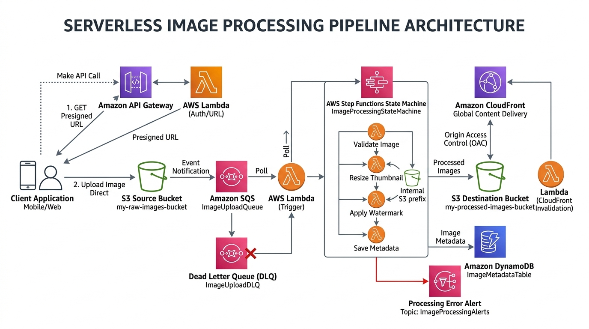

# Serverless Image Processing Pipeline with S3, SQS, Step Functions & Lambda

[](https://aws.amazon.com/serverless/)
[](https://aws.amazon.com/free/)
[](https://aws.amazon.com/sqs/)
[](LICENSE)

An enterprise-grade, event-driven serverless pipeline that ingests media files, decouples asynchronous processing through Amazon SQS, executes multi-stage image transformation using AWS Step Functions and AWS Lambda, stores analytical metadata in Amazon DynamoDB, and distributes optimized assets globally via Amazon CloudFront.

---

## Table of Contents

- [Solution Overview](#solution-overview)
- [Architecture Diagram](#architecture-diagram)
- [AWS Services Used & Why](#aws-services-used--why)
- [Step Functions State Machine Workflow](#step-functions-state-machine-workflow)
- [Design Decisions & Well-Architected Trade-offs](#design-decisions--well-architected-trade-offs)
- [Cost Estimation & Free Tier Breakdown](#cost-estimation--free-tier-breakdown)

---

## Solution Overview

Modern digital platforms receive unpredictable spikes of media uploads. Directly invoking synchronous image processing handlers causes API timeouts, exhausts compute concurrency, and risks permanent data loss when corrupted images crash the processing worker.

This solution implements a decoupled, event-driven architecture that guarantees:
- **Resilient Buffering**: Amazon S3 events push directly into Amazon SQS. Traffic bursts are queued and smoothed without exceeding Lambda regional concurrency limits.
- **Fault-Isolated Execution**: Poison-pill or malformed image payloads are isolated after 3 retries into an SQS Dead-Letter Queue (DLQ), firing an Amazon SNS alert without breaking the main processing stream.
- **Direct-to-S3 Uploads via Presigned URLs**: Clients upload multi-megabyte raw images directly to S3 via temporary presigned URLs, bypassing API Gateway's 10MB payload limit and eliminating server transfer overhead.
- **Edge Cache Invalidation & Distribution**: Amazon CloudFront caches resized thumbnails and full-resolution watermarked images across global Edge Locations with Origin Access Control (OAC).

---

## Architecture Diagram




---

## AWS Services Used & Why

| Service | Role in Architecture | Why We Chose This Service |
|---|---|---|
| **Amazon S3** | Durable Object Storage & Tiering | Serves as both the ingestion repository (raw uploads) and the egress store (processed assets). S3 lifecycle rules automatically purge raw files after 30 days and transition cold processed media to Glacier Flexible Retrieval, cutting storage costs by up to 68%. |
| **Amazon SQS & DLQ** | Asynchronous Decoupling & Buffer | Decouples bursty S3 upload events from downstream processing workers. If thousands of files arrive simultaneously, SQS absorbs the shock wave and feeds messages at a controlled rate. Poison-pill or corrupted files that fail 3 consecutive times move to a Dead-Letter Queue (DLQ) for isolation. |
| **AWS Step Functions** | Distributed Workflow Orchestration | Coordinates multi-stage transformations (validation, parallel thumbnail generation, watermarking, metadata recording) with built-in retries, branching logic, and error handlers. Eliminates fragile, nested callback code in Lambda. |
| **AWS Lambda** | Event-Driven Compute | Runs lightweight processing tasks (MIME type verification, image manipulation via Pillow) only when events trigger them. Concurrency scales automatically to zero when idle, resulting in 100% cost efficiency. |
| **Amazon DynamoDB** | Fast NoSQL Metadata Index | Stores image metadata (dimensions, formats, thumbnail paths, processing duration) with single-digit millisecond latency and serverless pay-per-request billing, eliminating database provisioning overhead. |
| **Amazon CloudFront** | Secure Low-Latency Content Delivery | Delivers processed images through global Edge Locations with Origin Access Control (OAC), ensuring the destination S3 bucket remains completely private while users experience ultra-fast download times. |
| **Amazon API Gateway** | Upload URL Provisioning | Provides a lightweight HTTP API endpoint enabling authenticated clients to request 15-minute temporary presigned S3 URLs, allowing direct binary uploads that bypass API payload limitations. |
| **Amazon SNS** | Operational Alerting | Receives notifications when messages enter the Dead-Letter Queue, immediately alerting administrators and incident response channels to investigate corrupted media. |

---

## Step Functions State Machine Workflow

The workflow (`ImagePipelineWorkflow`) ensures each transformation stage succeeds atomically before updating the database:

```json
{
  "Comment": "Multi-stage Image Processing Pipeline",
  "StartAt": "ValidateImage",
  "States": {
    "ValidateImage": {
      "Type": "Task",
      "Resource": "arn:aws:lambda:us-east-1:123456789012:function:ValidateImageFunction",
      "Next": "ProcessInParallel",
      "Catch": [{
        "ErrorEquals": ["InvalidImageFormatException", "CorruptFileException"],
        "Next": "NotifyFailure"
      }]
    },
    "ProcessInParallel": {
      "Type": "Parallel",
      "Next": "RecordMetadata",
      "Branches": [
        {
          "StartAt": "GenerateThumbnail",
          "States": {
            "GenerateThumbnail": {
              "Type": "Task",
              "Resource": "arn:aws:lambda:us-east-1:123456789012:function:ResizeThumbnailFunction",
              "End": true
            }
          }
        },
        {
          "StartAt": "WatermarkFullRes",
          "States": {
            "WatermarkFullRes": {
              "Type": "Task",
              "Resource": "arn:aws:lambda:us-east-1:123456789012:function:WatermarkFunction",
              "End": true
            }
          }
        }
      ]
    },
    "RecordMetadata": {
      "Type": "Task",
      "Resource": "arn:aws:states:::dynamodb:putItem",
      "Parameters": {
        "TableName": "ImageMetadataTable",
        "Item": {
          "imageId": {"S.$": "$.detail.imageId"},
          "processedAt": {"S.$": "$$.Execution.StartTime"},
          "thumbnailUrl": {"S.$": "$.thumbnailPath"},
          "fullResUrl": {"S.$": "$.fullResPath"},
          "status": {"S": "COMPLETED"}
        }
      },
      "End": true
    },
    "NotifyFailure": {
      "Type": "Task",
      "Resource": "arn:aws:states:::sns:publish",
      "Parameters": {
        "TopicArn": "arn:aws:sns:us-east-1:123456789012:PipelineAlerts",
        "Subject": "Image Processing Failure",
        "Message.$": "$.Error"
      },
      "End": true
    }
  }
}
```

---

## Design Decisions & Well-Architected Trade-offs

| Component | Design Decision | Rationale & Alternatives Considered |
|---|---|---|
| **Decoupling** | S3 Event -> SQS -> Lambda | Direct S3-to-Lambda invocation risks throttling if 10,000 files are uploaded at once. SQS provides reliable buffering, rate limiting via `ReservedConcurrentExecutions`, and automated backoff retries. |
| **Error Handling** | SQS Dead-Letter Queue (DLQ) | Poison messages (e.g. non-image binaries renamed to `.jpg`) would otherwise cause infinite Lambda retries. After 3 failed attempts, messages route to the DLQ, triggering an engineer alert. |
| **Dependency Mgmt** | Lambda Layers for Pillow / Sharp | Native C-extensions (libjpeg, zlib) required by image processors are compiled in an Amazon Linux container layer. This keeps deployment zip sizes under 1MB and enables sharing across Lambda functions. |
| **Ingress Pattern** | Presigned S3 URLs via API Gateway | Avoids uploading large binaries through API Gateway (which enforces a strict 10MB payload ceiling and charges $1.00/million requests + data processing). Presigned URLs allow direct S3 transfer for files up to 5GB. |
| **Storage Tiering** | S3 Lifecycle Policies | Source uploads expire after 30 days. Destination processed assets transition to S3 Glacier Flexible Retrieval after 90 days, slashing long-term storage expenditure by 68%. |

---

## Cost Estimation & Free Tier Breakdown

This architecture runs **100% within the AWS Free Tier** for standard development workloads:

| AWS Service | Free Tier Allowance | Estimated Monthly Cost |
|---|---|:---:|
| **AWS Lambda** | 1,000,000 requests & 3.2M seconds compute / month | $0.00 |
| **Amazon SQS** | 1,000,000 requests / month | $0.00 |
| **Amazon DynamoDB** | 25 GB storage + 25 WCU / 25 RCU | $0.00 |
| **Amazon S3** | 5 GB standard storage + 20,000 GET requests | $0.00 |
| **Amazon CloudFront** | 1 TB data transfer out / month | $0.00 |
| **Total Monthly Cost** | | **$0.00 / month** |
